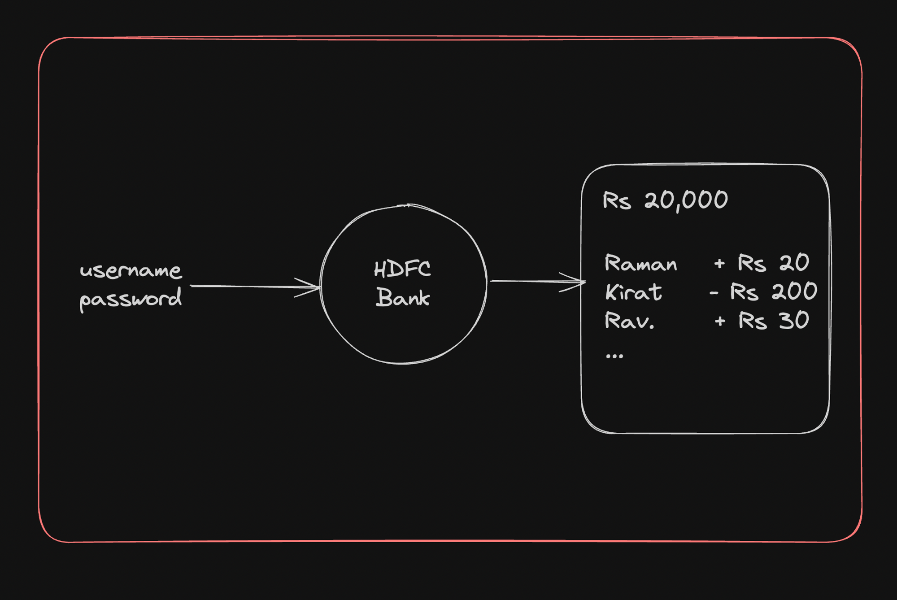
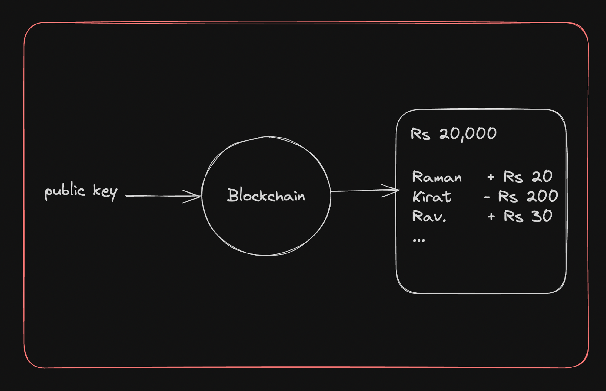
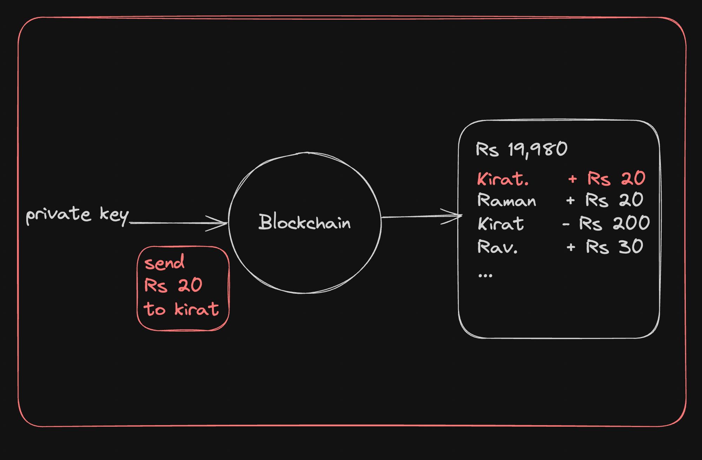

# Banks Vs Blockchains
## How do banks do Auth
In traditional banks, you have an `username` and `password` that are enough for you to -
 - Look at your funds
 - Transfer funds
 - Look at your existing transactions

## How do blockchains do Auth
The UX of performing transactions in blockchain totally is different from traditional banks.
If you ever want to create an `account` in a blockchain, you need to generate a `public-private` keypair.

### PUBLIC-PRIVATE Keypair
A public-private key pair is a set of two keys used in `asymmetric cryptography`. These two keys have the following characterstics - 
 - Public key - The public key is a string that can be shared openly.

 - Private key - The private key is a secret string that must be kept confidential.

