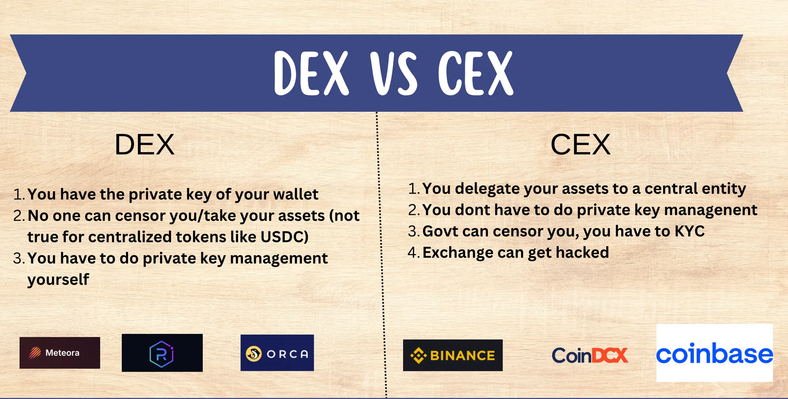

# Dentralized Exchanges
"Dex" stands for **Decentralized Exchanges**, which is a place where people can trade (buy or sell) cryptocurrencies directly with each other without using middleman, like a bank or traditional exchange.

### How is works in Blockchain
1. No middleman - There's no central entity managing the trades. You just use a platform (the marketplace) to find people willing to trade with you.

2. Smart Contracts - These are like automated stalls. You walk up to a stall, drop in your goods (cryptocurrency), and the smart contract ensures the trade happens safely and fairly with whoever wants to buy it. 

3. Direct Ownership - On a Dex, you own your cryptocurrency until the moment you decide to trade it. There's no central party holding it for you.

So, a Dex is basically a digital version of a farmer's market for trading cryptocurrencies without involving big intermediaries.

In simple terms, a DEX (Decentralized Exchange) is acryptocurrency trading platform that operateswithout a central authority, allowing users totrade assets directly with one another (peer-to-peer) using smart contracts.

# CEX
"Cex" stands for **Centralized Exchange**, which is an online platform where you can buy, sell, or trade cryptocurrencies, but this platform is run by a company that acts as a middleman to facilitate the trades.

### How it works in Blockchain
1. Middleman - The Cex (exchange) acts like the supermarket. It holds all the cryptocurrencies and manages the buying and selling for you. You deposit your money into their account, and they handle the trades.
2. Order Matching - When you want to buy or sell cryptocurrency, the Cex automatically matches your order with another user’s order, like how a supermarket restocks or sells items to customers.
3. Custody - When you trade through a Cex, you don’t actually hold your cryptocurrency directly. It’s more like putting money in your supermarket’s gift card; the exchange holds your crypto for you until you want to withdraw it.

So, a Cex is like a supermarket for cryptocurrencies where the company (the exchange) controls all the trading, matching, and storage of the assets. Unlike a Dex (the farmer’s market), here you rely on the supermarket (exchange) to handle everything for you.

## DEX vs CEX

## CEX Jargons
1. **Orderbooks**
An orderbook is like a menu board at a restaurant that lists all the buy and sell orders for a cryptocurrency in one place. It shows the prices people are willing to pay to buy (bids) and the prices at which others are willing to sell (asks).

2. **Bids**
Bids are the offers made by buyers to purchase a cryptocurrency at a specific price. 
In the CEX, bids are the prices that buyers are willing to pay for a particular cryptocurrency, listed in the orderbook.

3. **Asks**
Asks (or "offers") are the offers made by sellers who want to sell their cryptocurrency at a specific price.
In the CEX, asks are the prices that sellers are willing to accept for their cryptocurrency, and they also appear in the orderbook.

4. **Spread**
The spread is the difference between the highest bid price and the lowest ask price in the orderbook. It essentially shows the gap between what buyers are willing to pay and what sellers are willing to accept.

In CEX trading, a small spread usually means a more active market, while a large spread suggests less activity or fewer traders willing to agree on a price.

5. **Liquidity**
Liquidity refers to how easily and quickly you can buy or sell a cryptocurrency without affecting its price.

A market with high liquidity means you can quickly buy or sell large amounts of a cryptocurrency without much change in price. A market with low liquidity might make trades slower and lead to bigger price swings.

6. **Market Makers**
Market makers are traders or entities that add liquidity to the market by placing both buy (bid) and sell (ask) orders on the exchange. They help keep the market active and the spreads tight.

Market makers profit from the spread (the difference between their bid and ask prices) and help keep the market flowing smoothly.

**Summary**
so, all these terms play a role in understanding how a CEX works. Here's a quick recap -
- Orderbooks - A list of all buy and sell orders.
- Bids - Prices buyers are willing to pay.
- Asks - Prices sellers want to receive.
- Spread - The price gap between the highest bid and lowest ask.
- Liquidity - How easily you can trade without changing the price much.
- Market Makers - Entities that provide liquidity by always being ready to buy or sell.