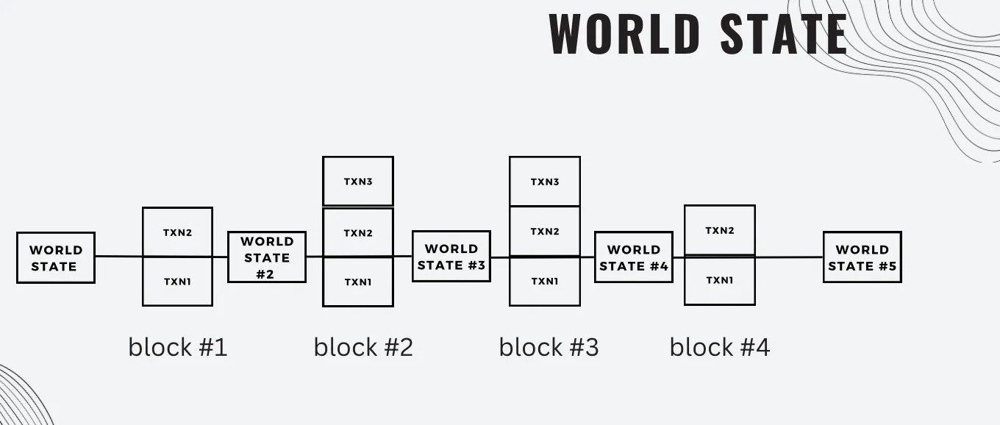
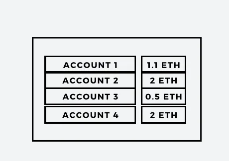
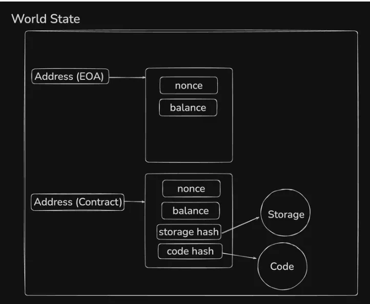
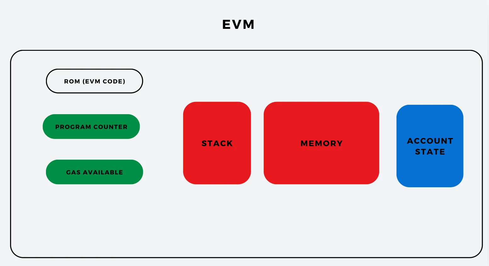

# Ethereum

## World State in Ethereum

In simple terms, the World State in Ethereum is a giant list that keeps track of the current situation for every account on the network. This includes two types of accounts - 
1. Externally Owned Accounts (EOAs) - These are accounts that people control with their private keys; like personal wallets.
2. Contract Accounts - These are accounts controlled by smart contracts instead of a private key.

**So, What does the World State do?**
The World State maps each account's address (the unique identifier for each account) to its current state. Each account's state includes details like - 
- Balance - How much ETH the account holds.
- Storage - Any data stored in the account (especially for contract accounts).
- Code - For contract accounts, this includes the actual code that smart contract runs.

**Simple Analogy**
Think of the World State as a spreadsheet where each row represents an account, and each column holds teh current details about the account. Whenever a transaction happens, this spreadsheet updates with the new balances, data, and any other changes.

So, the World State is the complete picture of the what every account on Ethereum currently "looks like" at any given moment.

**ETH as a State Machine**
Ethereum is a state machine whose state changes as more blocks are added to the blockchain. This means that Ethereum constantly updates its World State (the current situation of all accounts) whenever a new block of transactions is added.

The small box in the image represents an example of the World State at a specific point -
- Each account (like Account01, Account02, etc.) has a balance (e.g., 1.1 ETH, 2 ETH).
- When a new transaction is processed, these balances can change, reflecting the new state of Ethereum.

So, each time a new block is added, Ethereum's "state" updates to match the latest transactions, moving teh system to a fresh snapshot of all account balances and contract data. This is what it means for Ethereum to work like a "state machine".

#### Account types in ETH (EOA vs Contract Accounts)
*Externally Owned Accounts (EOAs)*
EOAs are like personal wallets on the Ethereum network.

*Putting it all together*
In Ethereum, an EOA is like personal bank account with a PIN code that you control. You can send ETH to others, receive ETH, and interact with smart contracts, but you're the one who starts all actions. It's a straightforward account with not extra features, just like a bank account that holds your money and lets you send it whenever you want.

*Contract Account*
In Ethereum, Contract Accounts are special accounts that are governed by code (smart contracts) instead of being controlled by private keys like Externally Owned Accounts (EOAs). Here's a closer look at their characterstics and what makes them unique -
1. Controlled by Code (Smart contracts)
    - Contract Accounts are managed by the smart contract code they contain. This means they don't have private keys and connot by directly accessed by a person. Instead, they operate based on the code that was set up when they were created.
2. Cannot Initiate Transactions 
    - Contract Accounts can't start transactions on their own. They can only respond to incoming transactions from EOAs or other contracts. So, an EOA needs to interact with the Contract Account first to "wake it up".
    - Once they receive a transaction, they can execute functions, udpate internal data, or ever interact with other contracts if programmed to do so.
3. Contains Smart contract code 
    - The smart contract code inside a contract Account can perform complex tasks. This code can contain ruls for various financial applications, manage business logic, or execute complex computations.
    - The code is usually written is Solidity (a programming language for Ethereum) and deployed to the blockchain, where it becomes permanent.
4. Ether balance
    - Like EOAs, contract accounts can hold ETH. However, they can only spend or transfer it based on the logic written in the smart contract. For example, a contract might only release ETH if specific conditions are met.
5. Gas costs
    - Executing functions in a Contract Account requires gas (paid in ETH). The gas fee is paid by the EOA initiating the transaction. If a contract function calls other contracts, it may use even more gas, and the EOA initiating the transaction covers this cost.
6. Permanent Deployment
    - Once a smart contract is deployed to the Ethereum blockchain, it’s immutable—meaning it can’t be modified or deleted. This ensures that the contract’s rules remain consistent, but it also means that any mistakes in the code are permanent.

Think of a Contract Account as a "robot" that operates according to specific set of intructions (its code) and can only take actions when someone interacts with it. Once set up, it follows its code without any need for human intervention, making it a powerful tool for automating transactions and other tasks on Ethereum.

This immutability and automation enable Contract Accounts to power decentralised applications (dApps) on Ethereum, where they execute tasks without needing human control, making transactions and interactions transparent and predictable.

### World State

**Nonce**
Think of a nonce like a unique ticket at a concert. Here's how it works -
**Externally Owned Account (EOA)**
- What is it?
    Imagine you are buying tickets to a concert. Each time you buy a ticket, you get a new number on it, like 1, 2, 3, and so on.
- Purpose:
    This number helps the concert organizers keep track of how many tickets you’ve bought. It ensures that no one can use the same ticket twice. If someone tried to sneak in with ticket number 1 again, they’d be stopped because that ticket has already been used.
- Real-life Example:
    Let’s say you are at a ticket booth. You buy your first ticket; it has the number 1. Next, you buy another ticket; it has the number 2. Your next ticket will be number 3. This way, each ticket (or transaction) is unique, and the organizers can see you are not trying to enter twice with the same ticket.

**Contract Account (Smart Contract)**
- What is it?
    Now, think about someone who creates a new game or event at the concert. Each time they create a new game, they also need to give it a unique name or code, like “Game1”, “Game2”, and so on.
- Purpose:
    This unique name ensures that every game is different and can be easily identified by participants. It prevents confusion about which game is which.
- Real-life Example:
    If a game organizer creates a game, the first one might be called “Game1”. If they create another game later, it will be “Game2”. Each new game has a unique name, so players know exactly which game to join.

- Nonce for EOA: Think of it like your ticket number. Each time you do something (like buy a ticket), you get a new number to keep things organized and prevent reuse.
- Nonce for Contract Account: Think of it like naming games. Each game has a unique name so that everyone knows which one is being referred to.

In both cases, the nonce helps keep everything organized and ensures that no mistakes happen, just like how unique ticket numbers and game names help manage a concert smoothly!

##### Storage Hash
1. Storage: The Smart Contract's Filing Cabinet
- What is Storage?
    - Think of storage as a filing cabinet where a smart contract keeps important information.
    - Each smart contract has its own filing cabinet, separate from others.
- Key-Value Store:
    - Inside this cabinet, the information is organized in a key-value store.
    - Key: This is like a label on a drawer that tells you what’s inside. For example, a drawer labeled “User Balances” might contain how much money each user has.
    - Value: This is the actual content inside the drawer. For instance, the value under “User Balances” could show:
        - Alice: 10 Ether
        - Bob: 5 Ether

2. The Storage Hash: The summary page of the Cabinet
- What is a Storage Hash?
    - Now, imagine instead of going through each drawer every time, you create a summary page that tells you about all the drawers and their contents.
    - This summary page represents the storage hash.
- Root Hash:
    - The storage hash is a compact version of everything in the filing cabinet, like a single page that summarizes all the key-value pairs.
    - It helps you quickly know what data is in your filing cabinet without opening every drawer.

*Code Hash*
- Smart contracts in Ethereum are written in high-level languages (like Solidity), but thye are compiled into EVM bytecode for execution on the Ethereum Virtual Machine (EVM).
- The code hash is cryptographic has (usually SHA3) of the contract's bytecode. It uniquely identifies the code of the contract.
- Once a smart contract is deployed on Ethereum, its code hash is permanently fixed unless the contract is destroyed.

### Ethereum Virtual Machine (EVM)
The **Ethereum Virtual Machine** is like the JVM, but has a different focus. Both are virtual machines that let programs run on different systems without needing changes.

1. Purpose:
    The JVM runs Java programs, while the EVM runs smart contracts on the Ethereum blockchain. Smart contracts are like self-executing agreements that run automatically when certain conditions are met.
2. Design:
    The EVM is built specifically for the Ethereum network and handles tasks like managing cryptocurrency transactions and executing smart contracts. The JVM, on the other hand, is designed for general-purpose applications.
3. Execution:
    The JVM executes Java bytecode, while the EVM executes bytecode created from smart contracts written in languages like Solidity.

In short, the EVM and the JVM are both virtual machines that allow code to run on different platforms, but the EVM is specifically for Ethereum and smart contracts, while the JVM is for Java programs.

#### Solidity, ABIs, Bytecode, and Opcode

1. Solidity Code - Solidity is a high-level programming language, similar to JavaScript or Python, that developers use to write smart contracts for Ethereum. This code specifies the logic and rules of the smart contract, like what it can do, how funds are managed, and under what conditions actions can be taken.
2. Bytecode - Once the Solidity code is written, it gets compiled into a low-level format called bytecode. The compiler converts the human-readable Solidity code into this bytecode, which is a set of instructions that the EVM can understand and execute.
3. EVM (Ethereum Virtual Machine) - The bytecode is then deployed to the Ethereum Virtual Machine (EVM). The EVM is like a global decentralized computer that runs on many nodes (computers) around the world, all part of the Ethereum network. The EVM executes the bytecode, carrying out the contract's instructions.
4. Cross-Platform Compatibility - The EVM is designed to be platform-independent, meaning it can operate on various operating systems like Windows, Ubuntu, and Linux. This compatibility allows Ethereum nodes to run on different devices and OS environments while still following the same rules and running the same bytecode, ensuring that the network remains consistent and decentralized.

**OPCODE**
Take a look - [evm.codes](https://www.evm.codes/)
Each part of the bytecode represents an opcode, which stands for "operation code". Opcodes are the individual instructions that tell the EVM what to do. Examples of opcode include basic operations like -
- Arithmatic (e.g., addition or subtraction)
- Data manipulation (e.g., storing and retrieving data)
- Control flow (e.g., jump to different parts of the code based on conditions)
Execution in the EVM: When a smart contract is deployed or executed, the EVM reads the bytecode one opcode at a time, following each instruction to carry out the actions coded in the smart contract.
In simple terms, opcodes are like commands in a recipe for the EVM, telling it exactly what steps to take, one at a time, to carry out the smart contract's functions.

**ABIs**
In Ethereum, an ABI (Application Binary Interface) is like a "traditional guide" that allows applications and users to interact with smart contracts. 
- Purpose of ABI - When a smart contract is deployed on the Ethereum blockchain, it operates using bytecode that the Ethereum Virtual Machine can understand. However, people and external applications need a way to communicate with this contract - for example, to call its functions or read its data. the ABI defines how this communication happens.
- Defining Contract Functions - The ABI includes details about the contract's functions, specifying -
    - The names of the functions,
    - The types of inputs each function requires,
    - The types of outputs (if any) it returns.
    This makes it clear for any application or user interface how to call specific functions on the contract.
- Encoding and Decoding data -
    - When an application sends data to the smart contract (like calling a function), the ABI tells it how to encode this data into the proper format.
    - When the contract sends data back (like returning a result), the ABI tells the application how to decode this data.
- Practical Example -
    - Let’s say there’s a smart contract that has a function to check a user’s balance. The ABI would specify that to call the “checkBalance” function, you need to provide the user’s address as input, and it will return a number (the balance) as output.
    - An application, such as a wallet, would use the ABI to correctly format the call to “checkBalance” and understand the response.

#### Architecture of EVM (Memory, Storage and contract)

In summary, we've learned about the internal workings of Ethereum, including the concepts of blocks, world state, and Ethereum as a state machine. We discussed the differences between Externally Owned Accounts (EOAs) and Contract Accounts, highlighting how EOAs are controlled by users while Contract Accounts execute smart contracts. Additionally, we explored important jargon such as the distinction between account types and their roles in the Ethereum ecosystem. Overall, this lecture provided us with a comprehensive understanding of Ethereum's architecture and functionality.