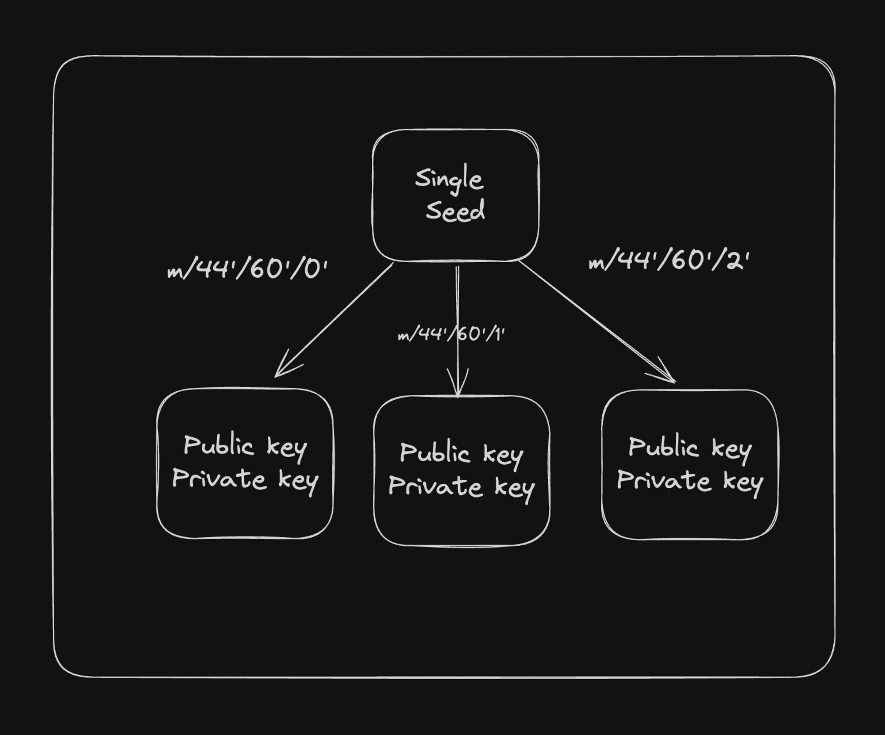

# Hierarchical Deterministic (HD) Wallet
Heirarchical Deterministic Wallets are a type of wallet that can generate a tree of keypairs from a single seed. This allows for the generation of multiple addresses from a single root seed, providing both security and convenience.

# Problem
You have to maintain/store multiple `public private` keys if want to have multiple wallets.

# Solution - BIP-32 
[Bitcoin Improvement Proposal](https://www.ledger.com/academy/what-is-a-bitcoin-improvement-proposal-bip) 32(BIP-32) provided the solution to this problem in 2012. It was proposed by Peiter Wullia, a Bitcoin Core developer, to simplify the recovery process of crypto wallets. BIP-32 introduced tree-like structure for wallets that allowed you to manage accounts much easily than previously possible. It's essentially a standardised way to derive public and private keys from a master seed.
