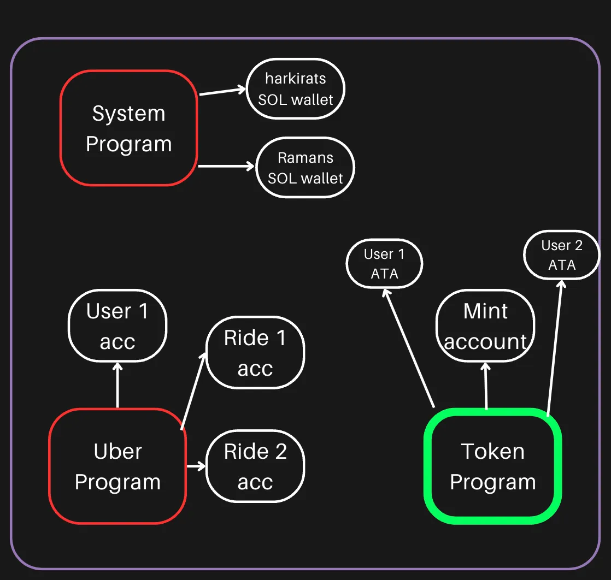

### Solana Blockchain
Imagine the Solana blockchain is like a giant library, but instead of books, it has millions of lockers. Each locker belongs to different people, and inside these lockers, people can store things like tokens (think of them as digital coins) or information (like contracts).

**The Players (People and Programs)**
- Accounts (Lockers): In Solana, these lockers are called accounts, and they belong to users (you, me, and anyone else) or to programs (apps, businesses).
- Programs (Apps or Services): Programs are like apps. Think of Uber, a ride-sharing app, which connects drivers with people who need rides. In Solana, these programs can interact with accounts.

**Token Program**
The token program is like a vending machine that creates and manages digital coins (tokens). These tokens can be used in different ways, like paying for things in a game or tading with other players.

In simple words, the Token Program is like system that:
- Creates digital coins (tokens) in the **Mint Account** (like a coin machine).
- Sends those tokens to peoples' wallets, such as User 1 ATA and User 2 ATA (your pockets or digital wallets).
- Keeps track of how many tokens each person has and allows them to use tokens in different programs or games.

It's like a super smart coin machine that knows how to create, send, and keep track of all the tokens!

**Mint Account**
The Mint Account is like the coin factory in the Solana world. Whenever someone wants to create new tokens (digital coins), they need this Mint Account. It's the place where the tokens are born!

Basically,
- Mint Account = Coin Factory; It makes new tokens.
- Once tokens are made, they go to different users' wallets (ATAs).
- You can think of the Mint Account as the place where all new tokens are created before being distributed to people.
It's a factory that produces and manages the creation of tokens!

#### Difference between ATA and Mint
**ATA (Associated Token Account)**
- An ATA is like a wallet that holds your specific tokens on the Solana Blockchain. Every user has an ATA for each token they own, and it's created automatically by the system whenever needed.
- Think of your ATA like your bank account at the State Bank of India (SBI). Whenever you earn, deposit, or tarnsfer money (Indian Rupees), your bank account automatically holds that money for you. You don't need to manually create a new bank account everytime -- You just use it to store and manage your Rupees.
- You ATA is automatically created when you receive a specific token. For instance, if you get Solana tokens (SOL), your ATA is the place where those tokens are stored securely.

**Mint Account**
- The Mint Account on Solana is the factory that creates new tokens. It controls the supply of tokens (like SOL or any other token) and is managed by the entity or program responsible for issuing them.
- The Reserve Bank of India (RBI) is like the Mint Account. It prints new Rupees and controls how much currency is in circulation. The RBI decides when to print new money and sends it out to the banks, just like a Mint Account on Solana creates and sends new tokens to users.
- The Mint Account controls how many tokens are created. For example, when a new token is introduced (like a new cryptocurrency or game token), the Mint Account issues these tokens to users’ ATAs.

In simple terms:
- ATA holds your tokens (like a bank acccount holds your Rupees).
- Mint Account creates the tokens (like the RBI prints new Rupees).

## PDA
A **Program Derived Address** (PDA) is a type of account on the Solana Blockchain that is associated with and owned by a program rather than a specific user or account.

*Think of it like a unique mailbox that can only be opened by a specific program.* 

### How PDAs work:
- PDAs are generated deterministically, meaning the same inputs will always create the same address.
- They are created using -
1. **User-defined seeds** - These can be anything, like your wallet address, a string, or even a number.
2. **A bump seed** - This is an extra number added to make sure the derived address isn't already used as a regular wallet address.
3. **Program ID** - Every smart contract (like the token program) on Solana has its own unique ID. This ID is also part of the formula to genrate a PDA.

The result is a unique PDA that the program controls, not a regular wallet with a public/private key pair. Only the program (in this case, the token program) can sign for transactions or interact with this PDA.

### How Data is stored in Web3
In **Web2**, data is typically stored in databases like SQL or NoSQL. But in Web3 - especially on blcokchains like Solana, data is stored differently.

So, while Web2 uses databases, Web3 uses accounts on the blockchain to store and manage data, and these accounts interact with smart contracts (like the Token Program) to ensure everything runs smoothly.

**Summary**
- Mint Account: Creates tokens (like USDC, BONK).
- ATA: Stores a user’s specific token balance (like a personal bank account).
- Data in Solana is stored decentrally using accounts, not in traditional databases like SQL or NoSQL.

The Solana blockchain is like a giant library of lockers (accounts) where users store tokens, and programs (apps) interact with these accounts. The Token Program creates and manages tokens through a Mint Account (like a coin factory) and stores them in users' ATA (wallets). PDA (Program Derived Address) simplifies account management by creating predictable addresses without needing private keys, making it easier for programs like Uber to track rides. In Web3, data is stored in blockchain accounts rather than traditional databases, ensuring secure and decentralized management.