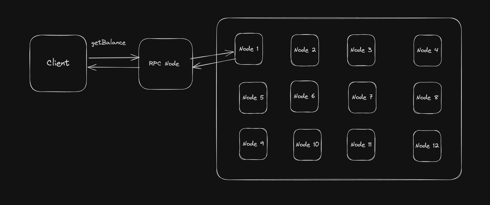

# RPC Server

An RPC server provides a way for external clients to interact with the blockchain network. RPC stands for `Remote Procedure Call`, and an RPC server exposes an API that allows client to send reqeust and receive responses from the blockchain.

An RPC server is service that listens for JSON-RPC from clients, processes these requests, and returns the results. It acts as an intermediary between the blockchain and external applications or services.

`` An RPC server is not inherently part of the blockchain network itself, nor does it participate in staking or concensus mechanisms. ``

You can grab your own RPC server from one of the many providers - 
- Quicknode
- Alchemy
- Helius
- Infura