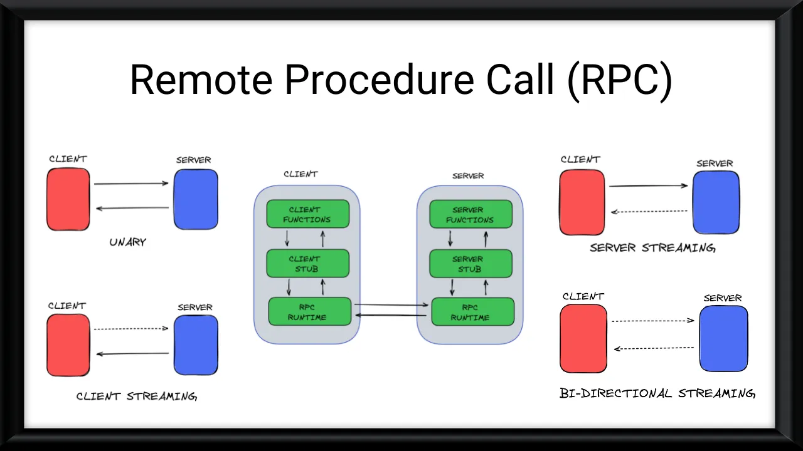
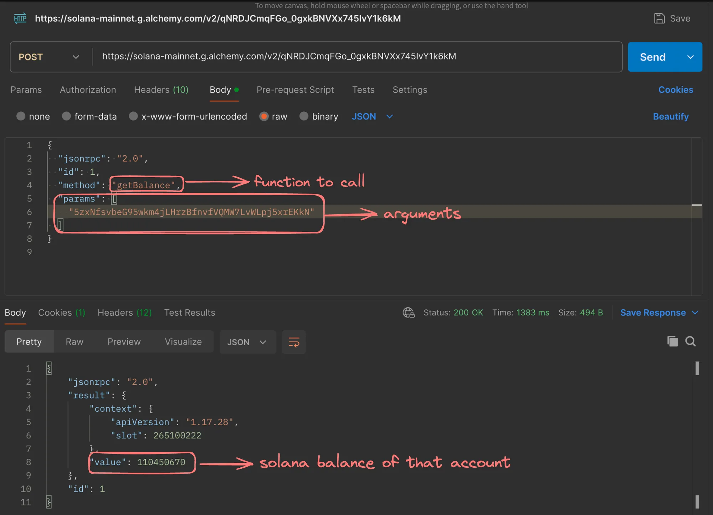

# RPC, JSON-RPC
JSON-RPC is a remote procedure call (RPC) protocol encoded in JSON (Javascript Object Notation). It allows for communication between a client and a server over a network. JSON-RPC enables a client to invoke methods on a server and receive responses, similar to traditional RPC but using JSON for data formatting.

AS a user, you interact with the blockchain for two purposes - 
 - To send a `transaction`.
 - To fetch some details from the blockchain (balances, etc).

In both of these, the way to interact with the blockchain is using JSON-RPC.
JSON-RPC Spec - [click me!!!](https://www.jsonrpc.org/specification)

``There are other ways to do RPC's like GRPC, TRPC``

## Understanding RPC
RPC is a client-server model where the client makes a request to exectue specific procedure or function on the server. The server processes the request, performs the requested operation, and sends the result back to the client. This process is transparent to the client, making it appear as if the procedure is being executed locally.


#### Why use RPC?
1. **Language and Platform independence**: RPC allows applications written in different programming languages and running on different platforms to communicate seamlessly. This promotes code reusability and interoperability across diverse systems.
2. **Abstraction of Communication Details**: RPC abstracts away the complexities of network communication, such as socket programming, serialization, and deserialization of data. Developers can focus on the application logic rather than low-level communication details.
3. **Distributed Computing**: RPC enables the distribution of computational tasks across multiple systems, allowing for better resource utilization, load balancing, and scalability.
4. **Code Modularity**: RPC promotes code modularity by separating the client and server components. This separation of converns makes the codebase more maintainable and easier to evolve.

#### Drawbacks of HTTP for Backend Communication
While HTTP is a widely used protocol for communication between web applications and servers, it has some limitation when it comes to backend-to-backend communication:
1. **Lack of Type Safety**: HTTP requests and responses are typically transmitted as plain text or JSON, which lacks type safety. This can lead to runtime errors and make it harder to ensure data integrity.
2. **Overhead**: HTTP has additional overhead due to headers, parsing, and serialization/deserialization of data, which can impact performance, especially in high-throughput scenarios.
3. **Language Dependency**: HTTP libraries and their usage can vary across programming languages, making it harder to maintain consistent communication patterns across different backend systems.
4. **Limited Funcionality**: HTTP is primarily designed for request-response communication, which may not be suitable for more complex scenarios like bi-directional streaming or long-lived connections.

RPC addresses these limitations by providing a more efficient, language-agnostic, and type-safe communication mechanism for backend systems.

To illustrate RPC in actions, let's consider making a HTTP request:
```javascript
const https = require('https');

const options = {
  hostname: 'sum-server.100xdevs.com',
  port: 443,
  path: '/todos',
  method: 'GET'
};

const req = https.request(options, (res) => {
  console.log(`Status Code: ${res.statusCode}`);

  res.on('data', (chunk) => {
    console.log(`Body: ${chunk}`);
  });

  res.on('end', () => {
    console.log('No more data in response.');
  });
});

req.on('error', (e) => {
  console.error(`problem with request: ${e.message}`);
});

req.end();
```

This code sends an HTTP GET request to the specified URL and logs the response status code and body to the console. While this approach works, it requires handling low-level details like creating the request options, managing the response data, and handling error explicitly.

With RPC, the communication between the client and server would be abstracted away, allowing developers to focus on the application logic rather than underlying communication details.

#### Implementing a Simple RPC
The idea behind implementing a simple RPC is to generate client code that can be used by different programming languages to call functions on a remote service without worrying about the underlying communication details, such as making HTTP requests or handling serialization/deserialization.

###### Autogenerated Client
Let's consider an autogenerated client in TypeScript that can fetch a list of todos from a remote service:
```typescript
// rpc.ts (autogenerated)
import axios from "axios";

interface Todo {
  id: string;
  title: string;
  description: string;
  completed: boolean;
}

async function getTodos(): Promise<Todo[]> {
  const response = await axios.get("<https://sum-server.100xdevs.com/todos>");

  let todos = response.data.todos;
  return todos;
}
```

In this example, the `genTodos` function is autogenerated and uses the axios library to to make an HTTP GET request to the specified URL. The function returns a `Promise` that resolves with an array of `Todo` objects, where the `Todo` interface is also autogenerated based on the expected response shape.

To use this autogenerated client, you can import the `getTodos` function and call it like this:
```typescript
// index.ts
import { getTodos } from "./rpc";

const todos = await getTodos();
console.log(todos);
```

#### Benefits of the Autogenerated Client
1. **Better Type Safety**: The `getTodos` function has an associated type for the data being returned (`Todo[]`), which provides better type safety and helps catch errors during development.
2. **Abstraction of Communication Details**: Developers no longer need to worry about using libraries like `axios` or `fetch` directly. They can simple call the `getTodos` function, which abstracts away the underlying communication details.
3. **Language Agnostic**: By autogenerating clients for different programming languages, this approach becomes language-agnostic, allowing backend systems written in different languauges to communicate seamlessly.

#### Sample Clients in other languages
To illustrate the language-agnostic nature of this approach, here are sample clients for the same `getTodos` function in Rust and Go:
**Rust**
```rust
use reqwest::Error; // Add reqwest = { version = "0.11", features = ["blocking", "json"] } in Cargo.toml

#[derive(Debug)]
struct Todo {
    id: String,
    title: String,
    description: String,
    completed: bool,
}

async fn get_todos() -> Result<Vec<Todo>, Error> {
    let response = reqwest::get("<https://sum-server.100xdevs.com/todos>").await?;

    let todos: Vec<Todo> = response.json().await?;
    Ok(todos)
}
```
**Go**
```go
import (
	"encoding/json"
	"fmt"
	"io/ioutil"
	"net/http"
)

type Todo struct {
	ID          string `json:"id"`
	Title       string `json:"title"`
	Description string `json:"description"`
	Completed   bool   `json:"completed"`
}

func getTodos() ([]Todo, error) {
	response, err := http.Get("<https://sum-server.100xdevs.com/todos>")
	if err != nil {
		return nil, err
	}
	defer response.Body.Close()

	body, err := ioutil.ReadAll(response.Body)
	if err != nil {
		return nil, err
	}

	var todos struct {
		Todos []Todo `json:"todos"`
	}
	if err := json.Unmarshal(body, &todos); err != nil {
		return nil, err
	}

	return todos.Todos, nil
}
```

These examples demonstrate how the autogenerated client can be used in different programming languages, providing a consitent and language-agnostic way to communicate with the remote service.
```
While this approach is a step towards a more efficient and type-safe communication mechanism, it still relies on JSON for serialization/deserialization, which can be slow compared to other formats like Protocol Buffers or gRPC.
```

## Protocol Buffers
Protocol Buffers (Protobuf) are Google's language-neutral, platform-neutral, extensible mechanism for serializing structured data. They provide an efficient and type-safe way to serialize and deserialize data, making them a popular choice for communication between different systems or programming languages.

#### Defining the Schema
Protobufs use a schema definition language (`.proto` files) to define the structure of data. Here's an example of a simple `.proto` file:
```proto
syntax = "proto3";

// Define a message type representing a person.
message Person {
  string name = 1;
  int32 age = 2;
}

service PersonService {
  // Add a person to the address book.
  rpc AddPerson(Person) returns (Person);

  // Get a person from their name
  rpc GetPersonByName(GetPersonByNameRequest) returns (Person);
}

message GetPersonByNameRequest {
  string name = 1;
}
```
In this example, we define a `Person` message type with two fields: `name` (string) and `age` (int32). We also define a `PersonService` with two procedure calls (RPCs): `AddPerson` and `GetPersonByName`. The `GetPersonByNameRequest` message is used as the input for the `GetPersonByName` RPC.

#### Field Numbers
Each field within a message type is assigned a unique numerical identifier called a field number or tag. These field numbers serve several purposes:
1. **Efficient Encoding**: Field numbers are used during serialization and deserialization to efficiently encode and decode the data. Instead of including field names in the serialised data, Protobufs use field numbers, which are typically more compact and faster to process.
2. **Backward Compatibility**: Field numbers are stable identifiers that remain consitent even if you add, remove, or reorder fields within a message type. This means that old serialized data can still be decoded correctly by newer versions of your software, even if the message type has changed.
3. **Language Independence**: Field numbers provide a language-independent way to refer to fields within a message type. Regardless of the programming language used to generate the code, the field numbers remain the same, ensuring interoperability between different implementations.

#### Serializing and Deserializing Data
Protobufs provide a binary serialization format that is more compact and efficient compared to text-based formats like XML and JSON. Here's an example of how to serialize and deserialise data using the `protobufjs` library in Node.js:
```javascript
const protobuf = require('protobufjs');

// Load the Protocol Buffers schema
protobuf.load('a.proto')
  .then(root => {
    // Obtain the Person message type
    const Person = root.lookupType('Person');

    // Create a new Person instance
    const person = { name: "Alice", age: 30 };

    // Serialize Person to a buffer
    const buffer = Person.encode(person).finish();

    // Write buffer to a file
    require('fs').writeFileSync('person.bin', buffer);

    console.log('Person serialized and saved to person.bin');

    // Read the buffer from file
    const data = require('fs').readFileSync('person.bin');

    // Deserialize buffer back to a Person object
    const deserializedPerson = Person.decode(data);

    console.log('Person deserialized from person.bin:', deserializedPerson);
  })
  .catch(console.error);
```
In this example, we load the `a.proto` schema, obtain the `Person` message type, create a `Person` instance, and serialise it to a binary buffer using `Person.encode(person).finish()`. We can then write the buffer to a file (`person.bin`). To deserialise the data, we read the buffer from the file and use `Perons.decode(data)` to obtain the deserialized `Person` object.

#### Size Comparison
One of the advantages of Protocol Buffers is their compact binary serialization format, which results in smaller data sizes compared to text-based formats like JSON. Let's compare the size of the serialized `Person` data with a JSON representation.
```json
{
  "name": "Alice",
  "age": 32
}
```
The size of the `person.bin` file (serialized with Protocol Buffers) is typically smaller that the JSON representation.

## Some common RPC Protocols
There are several RPC protocols availabe, each with its own strengths and use cases. Here are some common RPC protocols:
#### JSON-RPC
JSON-RPC is a lightweight remote procedure call protocol taht uses JSON as the data format for requests and responses. It is widely used in various applications, including blockchain platforms like Ethereum and Solana.


#### Creating a JSON-RPC Server
Here's an example of creating a simple JSON-RPC server using Express.js in Node.js:
```javascript
const express = require('express');
const bodyParser = require('body-parser');

const app = express();
const port = 3000;

// Parse JSON bodies
app.use(bodyParser.json());

// Define a sample method
function add(a, b) {
    return a + b;
}

// Handle JSON-RPC requests
app.post('/rpc', (req, res) => {
    const { jsonrpc, method, params, id } = req.body;

    if (jsonrpc !== '2.0' || !method || !Array.isArray(params)) {
        res.status(400).json({ jsonrpc: '2.0', error: { code: -32600, message: 'Invalid Request' }, id });
        return;
    }

    // Execute the method
    let result;
    switch (method) {
        case 'add':
            result = add(params[0], params[1]);
            break;
        default:
            res.status(404).json({ jsonrpc: '2.0', error: { code: -32601, message: 'Method not found' }, id });
            return;
    }

    // Send back the response
    res.json({ jsonrpc: '2.0', result, id });
});

// Start the server
app.listen(port, () => {
    console.log(`JSON-RPC server listening at <http://localhost>:${port}`);
});
```
In this example, we define an `add` function and handle JSON-RPC requests at the `/rpc` endpoint. The server expects a JSON-RPC request body with the `jsonrpc` version. `method` name, `params` array, and an `id`. If the request is valid, the server executes the corresponding method and sends back the result.

To test the server, you can send a JSON-RPC request like this:
```json
{
  "jsonrpc": "2.0",
  "id": 1,
  "method": "add",
  "params": [
    1, 2
  ]
}
```
The server should respond with the result:
```json
{
  "jsonrpc": "2.0",
  "result": 3,
  "id": 1
}
```
JSON-RPC is a simple and lightweight protocol, makint it suitable for various use cases, including blockchain interactions and general-purpose RPC communication.

#### gRPC
gRPC (Google Remote Procedure Call) is an open-source RPC framework developed by Google. It uses Protocol Buffers for efficient data serialization and provides features like streaming, load balancing, and authentication.

gRPC is widely used in microservices architectures and high-performance distributed systems due to its efficiency and language support. It generates client and server code in various programming languages based on the defined service definitions in Protocol Buffers.

#### tRPC
tRPC (TypeScript RPC) is a framework for building end-to-end type-safe APIs in TypeScript. It is designed for full-stack JavaScript/TypeScript applications and provides type safety on both the frontend and backend.

tRPC allows you to define you API routes and data types on the server-side, and it automatically generates TypeScript types for the client-side. This ensures that your client code is always in sync with the server API, reducing the risk of runtime errors and improving developer productivity.

tRPC is particularly useful for building full-stack applications with a shared codebase between the forntend and backend, as it eliminates the need for separate API documentation and client-side type definitions.