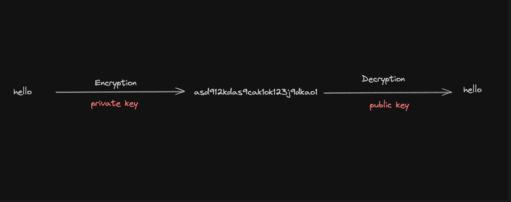

# Asymmetric Encryption
Asymmetric encryption, a.k.a public-key cryptography, is a type of encryption that uses a pair of keys: a public key, and a private key. The keys are mathematically related, but it is computationally not feasible to derive the `private key` from the `public key`.

Public Key: The public key is a string that can be shared openly.
Private Key: The private key is a secret cryptographic code that must be kept confidential. It is used to decrypt data encrypted with the corresponding public key or to create digital signatures.

## Common Asymmetric Encryption Algorithms
- RSA - Rivest-Shamir-Andleman
- ECC - Elliptic Curve Cryptography (ECDSA); ETH & BTC
- EdDSA - Edwards-curve Digital Signature Algorithm; SOL

How Elliptic Curve works - [click me!!!](https://www.youtube.com/watch?v=NF1pwjL9-DE&)

## Common eleptic curves
- secp256k1 - BTC and ETH
- ed25519 - SOL

### Few usecases of public key cryptography
- SSL/TLS certificates
- SSH keys to connect to servers, push to github
- Blockchains and crypto-currencies