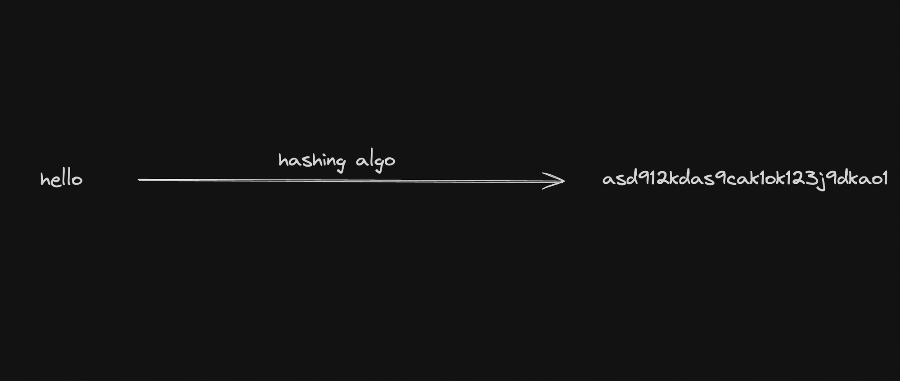
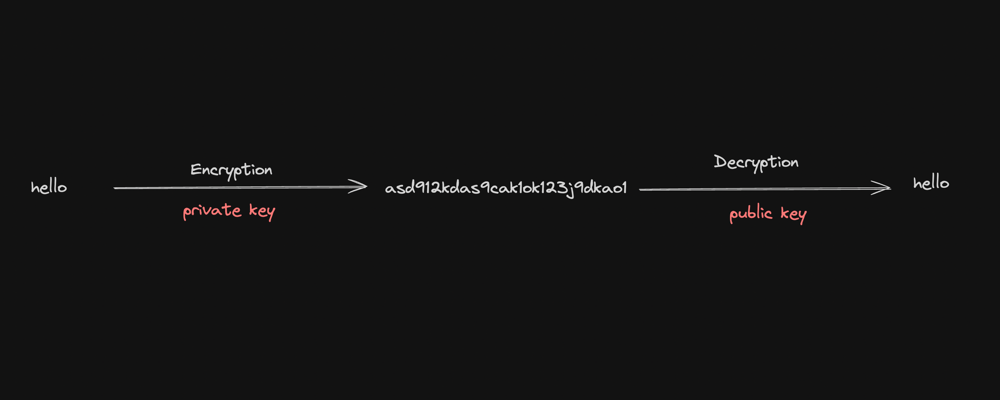

# Hashing vs Encryption
Hashing is a process of converting data (like a file or a message) into a fixed-size string of characters, which typically appears random.

### Encryption
Encryption is the process of converting plaintext data into an unreadable format, called ciphertext, using a specific algorithm and a key. The data can be decrypted back to its original form only with the appropriate key.
Key Characteristics:
 - Reversible: With the correct key, the ciphertext can be decrypted back to plaintext.
 - Key-dependent: The security of encryption relies on the secrecy of the key.
 - Two main types:
    - Symmetric encryption: The same key is used for both encryption and decryption.
    - Asymmetric encryption: Different keys are used for encryption (public key) and decryption (private key).

### Symmetric Encryption

```javascript
    const crypto = require('crypto');

    // Generate a random encryption key
    const key = crypto.randomBytes(32); // 32 bytes = 256 bits
    const iv = crypto.randomBytes(16); // Initialization vector (IV)

    // Function to encrypt text
    function encrypt(text) {
        const cipher = crypto.createCipheriv('aes-256-cbc', key, iv);
        let encrypted = cipher.update(text, 'utf8', 'hex');
        encrypted += cipher.final('hex');
        return encrypted;
    }

    // Function to decrypt text
    function decrypt(encryptedText) {
        const decipher = crypto.createDecipheriv('aes-256-cbc', key, iv);
        let decrypted = decipher.update(encryptedText, 'hex', 'utf8');
        decrypted += decipher.final('utf8');
        return decrypted;
    }

    // Example usage
    const textToEncrypt = 'Hello, World!';
    const encryptedText = encrypt(textToEncrypt);
    const decryptedText = decrypt(encryptedText);

    console.log('Original Text:', textToEncrypt);
    console.log('Encrypted Text:', encryptedText);
    console.log('Decrypted Text:', decryptedText);
```

### Asymmetric encryption
