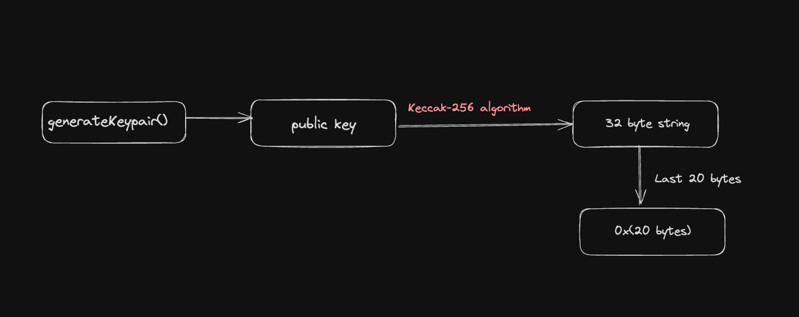

# Keccak 256
Try it out - [click me!!!](https://emn178.github.io/online-tools/keccak_256.html)  

Properties of `keccak-256` hashing algorithm
1. Collision resistance: Keccak256 is designed to be collision-resistant, meaning finding two inputs that produce the same hash output should be extremely difficult. However, it's important to note that collision resistance is not absolute, and there is always a small chance of collision. Therefore, it's recommended to use a combination of unique input parameters (e.g., block hash + block timestamp + contract nonce) for a lower probability of collisions.

2. Pre-image resistance: Keccak256 is also designed to be pre-image resistant, meaning it should be nearly impossible to determine the original input from the hash output. However, it's important to note that brute-force attacks can still be attempted, and stronger passwords or keys will increase security.

3. Key length: Keccak256 outputs a 256-bit hash value, which means that it has a very large output space. This makes it resistant to brute-force attacks, but it's important to ensure that the key length is also sufficient for the application.

4. Implementation: It's important to ensure that the implementation of Keccak256 used is secure and free from vulnerabilities. Additionally, the implementation should be updated regularly to ensure that any discovered vulnerabilities are patched.

## ETH

Ethereum public addresses are 20 bytes (0x8BCd4591F46e809B15A490F5C6eD031FDDE0bee0)

When generating the `public key` for an ETH address
 - Initially, a public key is generated using elliptic curve cryptography. 
 - The public key is then hashed using the Keccak-256 algorithm.
 - After hashing the public key with Keccak-256, you get a 32-byte hash. The Ethereum address is derived from this hash by taking only the last 20 bytes of the hash output.
 - The resulting 20-byte value is then converted into hexadecimal format and prefixed with '0x' to form the Ethereum address. This is the address that users use to send and receive ETH and interact with smart contracts.

## SOL
Solana public keys are 32 bytes
(5W4oGgDHqir3KNEcmiMn6tNHmbWjC7PgW11sk4AwWbpe). No need for hashing/chopping.