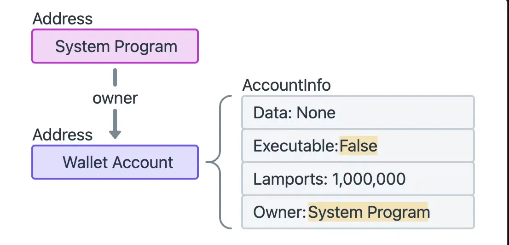

# Accounts
On Solana, all the data is stored in what are referred to as `accounts`. The way data is organised on Salana resembles a key-value store, where each entry in the database is called an 'account'.


#### Key points
- Accounts can store up to 10mb of data, which can consist of either executable program code or program state.
    - Programs (smart contracts) are stateless accounts that store executable code.
    - Data accounts are created by programs to store and manage program state.
- Accounts require a rent deposit in SOL, proportional to the amount of data stored, which is fully refundable when the account is closed.
- Every account has a program `owner`. Only the program that owns an account can modify its data or deduct its lamport balance. However, anyone can increase the balance.
- Native programs are built-in programs included with the Solana runtime.

#### Real-Life Example
Imagine you have a *gym locker* at a gym. In this analogy:
- Your locker number (key) is unique, just like each Solana has a unique *address*.
- Inside your locker, you might store gym clothes (data) or instructions for workout (program code).
- You pay rent for using the locker, but if you stop using it, you get your deposit back.
- Only you (the owner) can open the locker and change what's inside, but someone else can still add money to your locker.


In simple terms, on solana, all data is stored in what are reffered to as "accounts". The way data is organised on Solana resembles a [key-value store](https://en.wikipedia.org/wiki/Key%E2%80%93value_database), where each entry in the database is called as "account".

#### What is an Account?
In solana, an account is like a mailbox where you store data. Each account has a unique address, which is like your mailbox's number. This address is 32 bytes long and works like a public key (using the Ed25519 cryptography standard), making it secure.

*Account Info*
1. *Data (Bytes)*
- This is the actual information stored in the account, like letters or packages you put in the mailbox. The data is stored as a series of bytes.
2. *Executable (Boolean)*
- A simple *yes* or *no* values (true/false) that tells if the account contains executable code, like instructions for doing something (similar to having a manual in your mailbox).
3. *Lamports (Number)*
- This represents how many lamports (Solana's smallest unit of currency) the account holds. Think of lamports like money stored in the mailbox.
4. *Owner (Program Address)*
- This is the owner of the account, usually a program that controls what happens with the data inside. It's like having the person or entity responsible for that mailbox.

##### System Program
Solana contains a small handful of native programs that are part of the validator implementation and provide various core functionalities for the network.

*Solana's Native Programs*
On Solana, there are few built-in programs that help the network function. Think of these as essential services that keep everything running smoothly. The two most important ones you'll deal with when creating your own programs are the *System Programs* and the *BPF loader*.


**System Program**
The System Program is responsible for some of the most important tasks, like -
1. New Account Creation:
- It's like a **bank manager** that can open new bank accounts for you. Only the System Program has permission to create new accounts for Solana.
2. Space Allocation:
- Image when you open a new bacnk account, you also get a safe desposite box. This size of this box (how much space it has) is set by the System Program. This space is where your data will be stored.
3. Assign Program Ownership:
- After the System Program creates an account (bank account), it can hand over control of that account to a specific program, which could be a custom program you've created. This is how programs on Solana take control of newly created accounts.

**Wallet on Solana**
A wallet on Solana is like a bank account created by the System Program. It holds the SOL tokens (the currency) and the total balance is called the **lamport balance**.


##### Using `@solana/web3.js` to interact with the System Program

Create a new account with data and rent.
```javascript
const { Keypair, Connection, SystemProgram, Transaction } = require('@solana/web3.js');

const payer = Keypair.fromSecretKey(Uint8Array.from([222,61,190,103,38,70,4,221,24,242,44,86,66,111,102,52,87,41,83,45,166,179,184,79,208,91,20,66,142,36,147,236,30,84,33,77,227,36,159,27,27,53,27,249,230,207,30,83,42,51,3,225,70,41,44,85,54,31,198,80,45,49,208,39]));

const mintAthority = payer;

const connection = new Connection("https://api.devnet.solana.com");
async function main() {
    const newAccount = Keypair.generate();
    const TOTAL_BYTES = 165;
    const lamports = await connection.getMinimumBalanceForRentExemption(TOTAL_BYTES);
    const transaction = new Transaction();
    transaction.add(
        SystemProgram.createAccount({
            fromPubkey: payer.publicKey,
            newAccountPubkey: newAccount.publicKey,
            lamports: lamports,
            space: TOTAL_BYTES,
            programId: SystemProgram.programId,
        }),
    );

    await connection.sendTransaction(transaction, [payer, newAccount]);
    console.log(`New account created at ${newAccount.publicKey.toBase58()}`);
}

main();
```

Transfer lamports from your account to another account
```javascript
const { createMint } = require('@solana/spl-token');
const { Keypair, Connection, SystemProgram, Transaction } = require('@solana/web3.js');

const payer = Keypair.fromSecretKey(Uint8Array.from([222,61,190,103,38,70,4,221,24,242,44,86,66,111,102,52,87,41,83,45,166,179,184,79,208,91,20,66,142,36,147,236,30,84,33,77,227,36,159,27,27,53,27,249,230,207,30,83,42,51,3,225,70,41,44,85,54,31,198,80,45,49,208,39]));

const mintAthority = payer;

const connection = new Connection("https://api.devnet.solana.com");
async function main() {
    const newAccount = Keypair.generate();
    const TOTAL_BYTES = 165;
    const lamports = await connection.getMinimumBalanceForRentExemption(TOTAL_BYTES);
    const transaction = new Transaction();
    transaction.add(
        SystemProgram.transfer({
            fromPubkey: payer.publicKey,
            toPubkey: newAccount.publicKey,
            lamports,
        }),
    );

    await connection.sendTransaction(transaction, [payer, newAccount]);
    console.log(`Transferred to  ${newAccount.publicKey.toBase58()}`);
}

main();
```

Change the owner of an account
```javascript
const { createMint } = require('@solana/spl-token');
const { Keypair, Connection, SystemProgram, Transaction } = require('@solana/web3.js');

const payer = Keypair.fromSecretKey(Uint8Array.from([222,61,190,103,38,70,4,221,24,242,44,86,66,111,102,52,87,41,83,45,166,179,184,79,208,91,20,66,142,36,147,236,30,84,33,77,227,36,159,27,27,53,27,249,230,207,30,83,42,51,3,225,70,41,44,85,54,31,198,80,45,49,208,39]));

const connection = new Connection("https://api.devnet.solana.com");
async function main() {
    const newAccount = Keypair.generate();
    const owner = Keypair.generate();
    const TOTAL_BYTES = 165;
    const lamports = await connection.getMinimumBalanceForRentExemption(TOTAL_BYTES);
    const transaction = new Transaction();
    transaction.add(
        SystemProgram.createAccount({
            fromPubkey: payer.publicKey,
            newAccountPubkey: newAccount.publicKey,
            lamports: lamports,
            space: TOTAL_BYTES,
            programId: owner.publicKey,
        }),
    );

    await connection.sendTransaction(transaction, [payer, newAccount]);
    console.log(`New account created at ${newAccount.publicKey.toBase58()}`);
}

main();
```

### BPF Loader Program
The *BPF Loader Program* is like a software manager for the Solana network. It is responsible for handling all the custom programs (smart contracts) that developers create. Its job is to -
1. Deploy Programs:
- Just like a software manager installs new apps on a computer, the BPF Loader installs new program (smart contracts) on the Solana Network.
2. Upgrade Programs:
- It a developer needs to make changes or improve an existing program, the BPF Loader is responsible for upgrading it.
3. Execute Programs:
- Once the programs are deployed, the BPF Loader runs them, muck like a managers launches apps to perform certain tasks.

In simple terms, the [BPF loader](https://github.com/solana-labs/solana/tree/27eff8408b7223bb3c4ab70523f8a8dca3ca6645/programs/bpf_loader/src) is the program designated as the "owner" of all the other programs on the network, excluding native programs. It is responsible for deploying, upgrading, and executing custom programs.


### Authority in Solana Programs
In Solana, authority refers to a person or account that has the permission to take decisions or perform certain actions in a program. Just like in real life, some actions need approval or permission from the right person.

**Creating and Revoking mint authority**
- Create a new token
```bash
$ spl-token create-token
```

- Create an ATA (Associated Token Account)
```bash
$ spl-token create-account <token_mint_address>
```

- Try minting some tokens
```bash
$ spl-token mint <token_mint_address> 1000000000
```

- Revoke `mint authority`
```bash
$ spl-token authorize <token_id> mint --disable
```

- Try to mint again (would throw an error)
```bash
$ spl-token mint <token_mint_address> 1000000000
```
