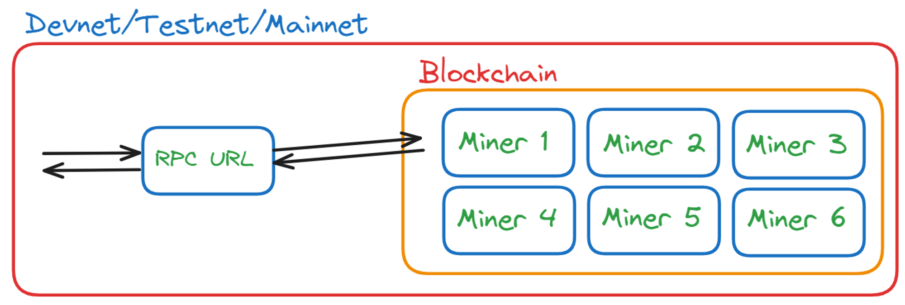

# Introduction to SOLANA

### Beyond Bitcoin
#### Limitations of Bitcoin - 
- Bitcoin primarily serves as a decentralised currency.
- It was not designed to support complex applications or diverse use cases.

#### The Rise of alternative Blockchains -
- `Post-2012 Developments` - Various blockchains emerged, each tailored for specific purposes, such as lending protocols or decentralised exchanges.
- Challenges faced:
    - `Fragmentation` - Each blockchain operated independently with its own set of miners and consensus mechanisms.
    - `Cold start problem` - New blockchains struggled to gain traction and security, unablt to match bitcoin's network size and robustness.

### Ethereum: A Revolutionary solution
- Ethereum introduced the concept of `smart contracts`, allowing developers to build decentralised applications (dApps) directly on the Ethereum network.
- Advantages of Ethereum:
    - No cold start problem - Developers could leverage Ethereum's existing decentralised network, avoiding the intial growth challenges faced by standalone blockchains.

e.g. Counter Contract on `Solidity`:
```javascript
    // SPDX-License-Identifier: MIT
    pragma solidity ^0.8.0;

    contract Counter {
        uint public count;

        // Constructor to initialize count
        constructor() {
            count = 0;
        }

        // Function to increment the count
        function increment() public {
            count += 1;
        }

        // Function to decrement the count
        function decrement() public {
            require(count > 0, "Count cannot be negative");
            count -= 1;
        }
        
        // Function to get the current count
        function getCount() public view returns (uint) {
            return count;
        }
    }
```

### Solana: A new Frontier
- `Smart contracts vs Programs`: What Ethereum calls `smart contracts`, Solana refers to as `program`.
- Solana offers similar capabilities to Ethereum but with significantly faster transaction speeds and scalabilty, high throughput and low latency.
- The design and operation of solana's programs differ from traditional blockchains, providing a distinct approach to building and running decentralised applications.

### Accounts in Solana
##### What is an Account?
- In Solana, an account is a data structure that includes a public-private keypair (using the `ed25519` elliptic curve).
- Types of Accounts:
    - Wallet Accounts - These accounts represent user wallets that can hold `lamports` (Solana's native currency).
    - Data Accounts - These accounts store data on the blockchain and can be used for various decentralized applications.
    - Program Accounts - These are special accounts that store executable code, allowing smart contracts (known as "programs" in Solana) to run on the blockchain.

### Rent on Solana
- Purpose of Rent - To prevent the blockchain from being clogged with inactive or unnecessary data, Solana charges rent for storing data.
    - Rent Calculation - Rent is based on the storage size and the duration the account remains on the blockchain.
    - Rent Exemption - If an account maintains a balance above a certain threshold, it becomes "rent-exempt," meaning it does not incur further rent charges. The rent paid is refundable when the account is closed.

    [What is Rent on Solana, and how to calculate it](https://www.quicknode.com/guides/solana-development/getting-started/understanding-rent-on-solana)

### Efficient Storage Management
- Incentivizing Minimal Storage - The rent model encourages users to store only the necessary data, reducing blockchain bloat.
- Removing Inactive accounts - Accounts that fail to pay the required rent are eventually removed from the ledger, ensuring use of blockchain resources.

### Calculating Rent-Exempt Threshold
- Methods to calculate:
    1. Solana CLI - Command-line interface tools.
    2. Solana Web3.js Library - JavaScript library for interacting with the Solana Blockchain.
    3. Anchor's Space Constraint - A framework-specific approach for calculating space requirements for accounts.

### RPC URL, Testnet, Devnet, and Mainnet


#### What is an RCP URL?
- RPC (Remote Procedure Call) URLs allow applications like browsers, wallets, and users to interact with the Solana Blockchain.
- By sending requests to an RPC URL, you can query the blockchain and perform various operations.
- How to use RPC URLs:
    - Mainnet - `https://api.mainnet-beta.solana.com`
    - Devnet - `https://api.devnet.solana.com`
    - Testnet - `https://api.testnet.solana.com`
<br />
[Clusters and Public RPC endpoints | Solana](https://solana.com/docs/core/clusters)

### Changing RPC URLs
Use the following commands to set the appropriate RPC URL for your environments:

```sh
# Set RPC URL for Mainnet
$ solana config set --url https://api.mainnet-beta.solana.com

# Set RPC URL for Devnet
$ solana config set --url https://api.devnet.solana.com

# Set RPC URL for Testnet
$ solana config set --url https://api.testnet.solana.com
```

#### Salana Networks
- Mainnet - The live Solana Blockchain where real transactions occur. It's secure and used for deploying production applications.
- Testnet - A testing environment that mimics the mainnet but is used for testing applications before deploying them to the mainnet. It does not use real SOL.
- Devnet - A development environment similar to the testnet but specifically for developers to experiment and test applications. You can freely request SOL from the [Solana Devnet Faucet](https://www.google.com/search?q=Testnet%3A+A+testing+environment+that+mimics+the+mainnet+but+is+used+for+testing+applications+before+deploying+them+to+the+mainnet.+It+does+not+use+real+SOL.Devnet%3A+A+development+environment+similar+to+the+testnet+but+specifically+for+developers+to+experiment+and+test+applications.+You+can+freely+request+SOL+from+the+Solana+Devnet+Faucet+for+testing+purposes.&sourceid=chrome&ie=UTF-8) for testing purposes.

#### Using Devnet and Testnet
- Airdrop SOL - On Devnet, you can use teh faucet to receive free SOL for testing.
- Local Testing - Use the Solana Test Validator to start a local validator for testing applications without replying on external networks.
```
solana-test-validator
```

#### Solana Explorer
- Explorer tool - You can view transactions, account balances, and more on the Solana Blockchain using the [Solana Explorer](https://explorer.solana.com/), which supports Devnet, Testnet, Mainnet, and custom RPC URLs.

### Web2 Data Model vs. Solana Data Model

###### Web2 Data Model
- Applications are typically deployed on cloud providers with backend code and data storage separated.
- `Databases` - Use SQL or NoSQL databases to store user data.
- `Data Managements` - Adding or deleting a user involves simply adding or removing a row in the database.


###### Solana Data Model
- Smart Contracts - In Web3, smart contracts are equivalent to backend applications in Web2. These are deployed on the blockchain.
- Program Storage - On solana, smart contracts (called `programs`) are stored in executable accounts.
- Data Storage - Unlike Ethereum, where data and smart contract code are stored together, Solana separates them:
    - Data accounts - Store data independently from programs.
    - Executable accounts - Store the smart contract code (programs).


#### Key differences and implications
- User Account Management:
    - In Solana, each user requires a separate account, which adds complexity compared to simply adding a row in a Web2 database.
    - User-Paid Fees - The responsibility for creating and funding these accounts, including paying for data rent, is delegated to the user.
    - Decentralised Fees - Users pay the fees for their individual accounts, not the program itself. If an account is closed, any remaining rent is refunded to the user.

### Token program on Solana

##### Creating token: Ethereum vs. Solana
- Ehtereum:
    - To create a token, you must deploy you own smart contract.
    - Ethereum provides a standard template (ERC-20), but each token requires its own contract to be deployed on the blockchain.
- Solana:
    - Solana simplifies this process with a single, pre-deployed Token Program.
    - Instead of deploying a new contract, you only need to create a token account under this program.
    - This significantly reduces complexity and deployment costs.

#### Understanding Tokens
- Tokens represent one of the primary use cases of blockchain technology, acting as digital assets or currencies that can be traded on the blockchain.
    - Examples - USDC and USDT are popular stablecoins that have found significant market adoption. These tokens do not have their own blockchain; instead, they operate as smart contracts on existing blockchains like Ethereum and Solana.

- Why use existing Blockchain?
    - Tokens like USDC and USDT leverage the security and infrastructure of established blockchains such as Solana and Ethereum. This allows them to function without maintaining their own blockchain or miners.

- The Token Program is essentially a mapping from as account to a number, representing the balance of token help by an account.

Explore various tokens and their market data on [CoinMarketCap](https://coinmarketcap.com/).

#### Solana's Token Program
- Centralised token program:
    - Solana engineers recognised the importance of tokens and created a dedicated Token Program.
    - This program is pre-deployed on the Solana blockchain, simplifying token creation.
- Mint Accounts:
    - When creating a token on Solana, you establish a `mint account` under the token program.
    - A mint account functions like a bank for your token, overseeing its supply but without executing any code. It does not run transactions or logic on its own; instead, it is responsible for managing the minting and overall supply of tokens.
- Associated token account:
    - Associated Token Account is a token account whose address is deterministically derived using the owner's address and the mint account's address.