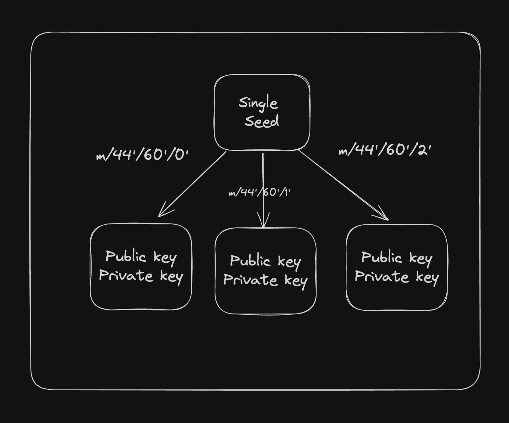

## Mnemonics
A Mnemonic phrase (or seed phrase) is a human-readable string of words used to generate a cryptographic seed. BIP-39 (Bitcoin Improvement Proposal 39) define how mnemonic phrases are generated and converted into a seed.
`reference` [click me!!!](https://github.com/bitcoin/bips/blob/master/bip-0039/english.txt) <br />

## Seed phrase
The seed is a binary number derived from the mnemonic phrase.
```javascript
    import { generateMnemonic, mnemonicToSeedSync } from "bip39";

    const mnemonic = generateMnemonic();
    console.log("Generated Mnemonic:", mnemonic);
    const seed = mnemonicToSeedSync(mnemonic);
```

### Derivation Paths

- Derivation paths specify a systematic way to drive various keys from the master seed.
- They allow users to recreate the same set of addresses and private keys from the seed across different wallets, ensuring inter-operability and consistency. (example; if you ever want to port from phantom wallet to backpack).
- A derivation path is typicaly expressed in a format like `m / purpose' / coin_type' / account' / change / address_index`.
    - `m` : Refers to the  master node, or the root of the HD wallet.
    - `purpose`: A constant that defines the purpose of wallet (e.g., `44` for BIP44, which is a standard for HD wallets).
    - `coin_type`: Indicates the type of cryptocurrency (e.g., `0'` for Bitcoin, `60'` for Ethereum, `501'` for Solana).
    - `account`: Specifies the account number (e.g., `0'` for the first account).
    - `change`: This is either `0` or `1`, where `0` typically represents external addressses (receiving addresses), and `1` represents internal addresses (change addresses).
    - `address_index`: A sequential index to genrate multiple addresses under the same account and change path.

```javascript
    import nacl from "tweetnacl";
    import { generateMnemonic, mnemonicToSeedSync } from "bip39";
    import { derivePath } from "ed25519-hd-key";
    import { Keypair } from "@solana/web3.js";

    const mnemonic = generateMnemonic();
    const seed = mnemonicToSeedSync(mnemonic);
    for (let i = 0; i < 4; i++) {
    const path = `m/44'/501'/${i}'/0'`; // This is the derivation path
    const derivedSeed = derivePath(path, seed.toString("hex")).key;
    const secret = nacl.sign.keyPair.fromSeed(derivedSeed).secretKey;
    console.log(Keypair.fromSecretKey(secret).publicKey.toBase58());
    }
```

REFERENCE [SOL]( https://github.com/coral-xyz/backpack/blob/master/packages/secure-background/src/blockchain-configs/solana/config.ts#L38) <br />